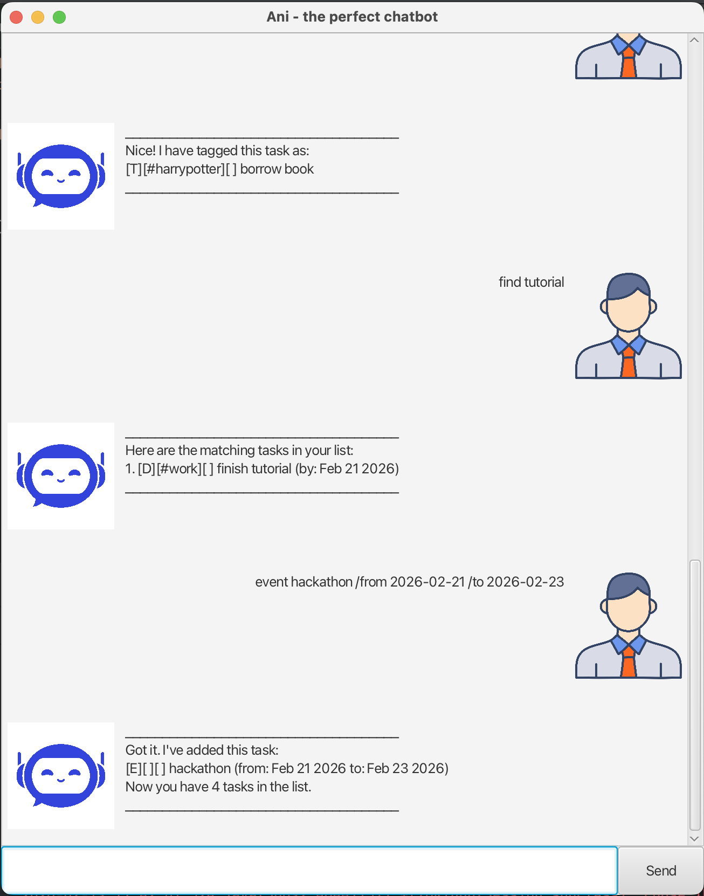

# Ani User Guide




Ani - The perfect chatbot. Ani is responsible for helping you keep track of all your 
tasks, set reminders, deadlines and even log in events that you may have on a daily basis. 
You can easily view your tasks, mark or unmark them and even tag them to your liking!

## Adding deadlines

Deadlines are used for tasks that need to be done by 
a certain date. 

You need to finish a script, read a book, or do your tutorial by a certain date
, this command will come in handy.


Example: `deadline finish script #work /by 2026-02-01`

The task is saved under task list and the below output is shown
to show that this task has been successfully added.

```
___________________________________________
Got it. I've added this task:
[D][#work][] finish script (by: Feb 1 2026)
___________________________________________
```

## Adding events

Events are used for tasks that are over a period of time
with a start date and a end date.

You have a debate competition from Feb 2 2026 to Feb 4 2026,
or you have your exam week from Feb 2 2026 to Feb 7 2026.

Example: `event debate competition #school /from 2026-02-02 /to 2026-02-07`

The task is saved under task list and the below message is shown for the user 
to know that the task has been successfully added.

```
_________________________________________________________
Got it. I've added this task:
[E][#school][] debate competition (from: Feb 2 2026 
to: Feb 7 2026)
_________________________________________________________

```

## Adding todos

Todo tasks are simple tasks that do not have deadlines and just need to get done as and when possible.

These include, borrow books, read Harry Potter, or scroll tiktok!

Example: `todo borrow book #fun`

The task is saved under task list and the following message is shown as a confirmation.

```
_________________________________________
Got it. I've added this task:
[T][#fun][] borrow book
_________________________________________

```

## Listing tasks

List allows for viewing of all the tasks that are currently in the task list and are numbered.

For example, if the task list has todo tasks, event tasks and deadline tasks, they are represented
together as a list of tasks.

Example: `list`

All the tasks are shown.

```
________________________________________________
Here are the tasks in your list:

1.[T][#fun][] borrow book
2.[D][#work][] finish homework (by: Feb 2 2026)
3.[E][#school][] debate competition (from: Feb 2 2026 to: Feb 7 2026)
________________________________________________

```

## Marking tasks

Marking allows for users to easily track tasks that are done.

For example, if a certain task is done, it can be marked as done, 
or if you finished your homework, the task can be marked, indicating that
it is finished.

Example: `mark 2`

The task that is at number 2 in the list of tasks will be then marked as done.

```
______________________________________________
Nice! I have marked this task as done:
[D][#work][X] finish tutorial (by: Feb 21 2026)
_______________________________________________

```

## Unmarking tasks

Unmarking tasks allows for users to make changes to the marking that has been made.

If the homework that is supposedly finished has changes that need to be made to it,
I can unmark the task, indiciating that it has not been finished yet.

Example: `unmark 2`

The task that is at number 2 in the list of tasks will be unmarked.

```
________________________________________________
OK, I've marked this task as not done yet:
[D][#work][] finish tutorial (by: Feb 21 2026)
________________________________________________

```

## Finding tasks

Finding tasks allows for tasks to be easily found in a list if details need to be known.

For example, if I want to know the tutorial number of the tutorial sheet I need to complete for 
CS2105 module, I can search find CS2105, and then view the task description to know the tutorial number.

Example: `find tutorial`

Task with tutorial in the task description will appear.

```
____________________________________________________
Here are the matching tasks in your list:
1. [D][#work][] finish tutorial (by: Feb 21 2026)
____________________________________________________

```

## Tagging tasks

Tagging tasks allows you to place tags on a task, for easy identification of what the task is as well.

I am able to add the task of finishing tutorial and add the tag of #CS2103T to know that, the tutorial is 
one that belongs to the module CS2103T.

Example: `tag 3 #CS2103T`

Tags the task at number 3 as CS2103T.

```
_______________________________________________________
Nice! I have tagged this task as:
[D][#CS2103T][] finish tutorial (by: Feb 21 2026)
_______________________________________________________

```

## Deleting tasks

Deleting tasks allows you to remove the task from the list.

If I have completed borrowing a book, I want to remove it from the task list, I can use the delete command.

Example: `delete 2`

Deletes the task at number 2.

```
________________________________________________________
Noted. I've removed this task:
[D][#CS2103T][] finish tutorial (by: Feb 21 2026)
Now you have 4 tasks in the list.
________________________________________________________

```

